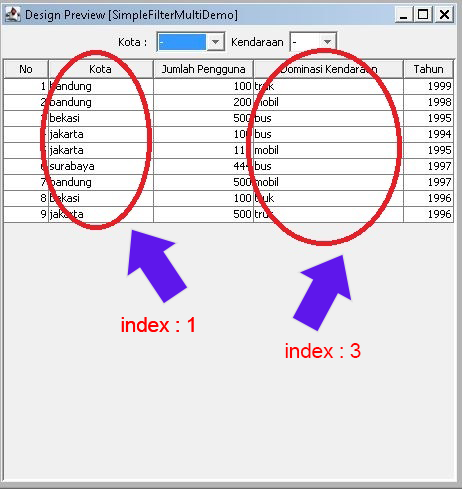
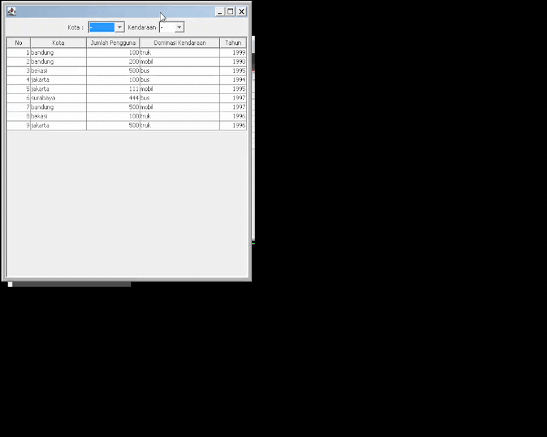

# Real case's exposed!
When java developers tend to use a combobox as its filter mechanism in swing JTable. They need simplification. This yet small library is the answer!

## What are the benefits?
1. You don't need to curse the for-loop of your own code!
2. You don't even need to write any *if else matching* for each components.
3. You use as the simplicity as it is!


## Supported

Matters 		| Detail
--------------- | ------------
O.S.     		| Linux & Windows
JDK      		| Java 5 - 19 
Ex. Libraries  	| No
Footprint 		| 13,1 Kb


# How To use?

1. import the Jar under dist\SimpleFilter.jar
2. use with ease as the following examples

# Download
[v1.0 -jar](dist/SimpleFilter.jar)

## Quick Example -01-
You have the jcombobox, and the jtable. So, let initialize 'em all with :

```
// 1st example for a simple one
SimpleFilter sf = new SimpleFilter(true);
sf.setFilterComponent(combobox);
sf.setTable(myJTable);
```


## Quick Example -02-
You have several jcomboboxes, and the jtable. So, let initialize 'em too :

```
// now as 2nd example with column positioning
SimpleFilter sf = new SimpleFilter(true);
sf.setFilterComponents(combobox1, combobox2);
// matching the position of each column for each comboboxonly
sf.setColumnPositionRef(1, 3);
sf.setTable(myJTable);  
```

# screenshot
take a look of the position here:



# preview
check the demo below: 
